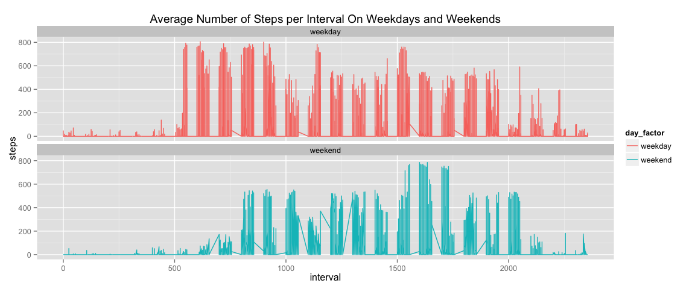

# Reproducible Research: Peer Assessment 1

## Loading and preprocessing the data

```r
library(data.table) # easier processing
library(magrittr) # more readable code
library(ggplot2) 

# read in the data as a data.table
activity_data <- 
        read.csv("~/Documents/DataScienceCoursera/RepData_PeerAssessment1/activity.csv") %>%
        as.data.table()
```

*****

## What is mean total number of steps taken per day?


```r
# take the sum of steps, excluding NAs, by date
daily_number_steps <- 
        activity_data[, sum(steps, 
                            na.rm = TRUE), 
                      by = date]

# create the histogram of frequencies of steps for days
hist(daily_number_steps$V1, 
     breaks = 15, 
     xlab = "Steps Taken", 
     main = "Total Number of Steps Taken Each Day")

# take the mean of the total number of steps by day
mean_total_steps <- 
        mean(daily_number_steps$V1)

# take the median of the total number of steps by day
median_total_steps <-
        median(daily_number_steps$V1)

# add lines on the plot for these values
abline(v = mean_total_steps, 
       col = "red")

abline(v = median_total_steps, 
       col = "blue")
```

 

#### The mean total steps taken per day is 9354.23.
#### The median total steps taken per day is 10395.

*****

## What is the average daily activity pattern?

```r
# create the time series by taking the mean of steps over the intervals
ts <- 
        activity_data[, mean(steps, na.rm = TRUE), 
                      by = interval]

# plot the mean we just calculated (y) against interval (x)
plot(ts$V1 ~ ts$interval,
     type = "l", 
     xlab = "Interval", 
     ylab = "Average Steps Taken",
     main = "Average Number of Steps by 5-Minute Interval")
```

 

```r
# find the interval with the highest mean steps
highest_interval <-
        ts[V1 == max(V1)][, interval]
```

#### The 5-minute interval with the average highest number of steps is 835.

*****

## Imputing missing values

```r
# find the number of incomplete rows in the dataset
number_NA <- 
        sum(!complete.cases(activity_data))

# use mean for corresponding interval to fill in NAs

# split the data between complete cases, 
activity_data <- 
        activity_data[complete.cases(activity_data)]
# and incomplete cases
new_activity_data <- 
        activity_data[!complete.cases(activity_data)]

# rename ts columns so we can merge with the new dataset we just created of incomplete cases
colnames(ts) <- 
        c("interval",
          "steps")

# merge the data to get a complete dataset
new_activity_data <- 
        merge(new_activity_data, 
              ts, 
              by = "interval")

# delete the columns we don't need anymore; clean up the data
new_activity_data[, steps := steps.y]
new_activity_data[, c("steps.x", "steps.y") := 
                          NULL  %>% list()]

# add the complete cases back in for a new dataset with completed columns
new_activity_data <- 
        rbind(activity_data, new_activity_data)

# recalculate the total steps by date using the new data
new_daily_number_steps <- 
        new_activity_data[, sum(steps), by = date]

# remake histogram with the new data
hist(new_daily_number_steps$V1, 
     breaks = 15, 
     xlab = "Steps Taken", 
     main = "Total Number of Steps Taken Each Day")

# recalculate mean and median with the new data
new_mean_total_steps <-
        mean(new_daily_number_steps$V1)

new_median_total_steps <- 
        median(new_daily_number_steps$V1)

# add the new lines corresponding to the mean and median to the new graph
abline(v = new_mean_total_steps, 
       col = "red")

abline(v = new_median_total_steps, 
       col = "blue")
```

 

#### The number of rows containing NAs is 2304. 

#### Using the strategy on filling in NAs with the mean for the corresponding 5-minute interval, the mean total number of steps is now 10766.19 and the median total number of steps is now 10765. These values are both larger than their corresponding matches from the first part of the assignment. The estimates are much closer to each other and the data less skewed resulting in potentially more accurate estimation of the values.

*****

## Are there differences in activity patterns between weekdays and weekends?


```r
# calculate the days of the week for each of the dates
new_activity_data[, day := 
                          weekdays(new_activity_data$date  %>%
                                           as.Date())]

# create the factor variables for weekends and weekdays
new_activity_data[, day_factor :=
                          factor(ifelse(new_activity_data$day %in% 
                                                c("Saturday", 
                                                  "Sunday"),
                                        TRUE, 
                                        FALSE), 
                                 labels = c("weekday", 
                                            "weekend"))]

# create the plot with the two facets for weekend/weekday
ggplot(new_activity_data, 
       aes(x = interval, y = steps, colour = day_factor)) + 
        
        geom_line() + 
        
        facet_wrap(~ day_factor, 
                   nrow = 2) +
        
        ggtitle("Average Number of Steps per Interval On Weekdays and Weekends")
```

 

#### The plot above shows the average number of steps per interval on weekdays and weekends. As expected, there appears to be overall less activity on weekends with a later start time.
